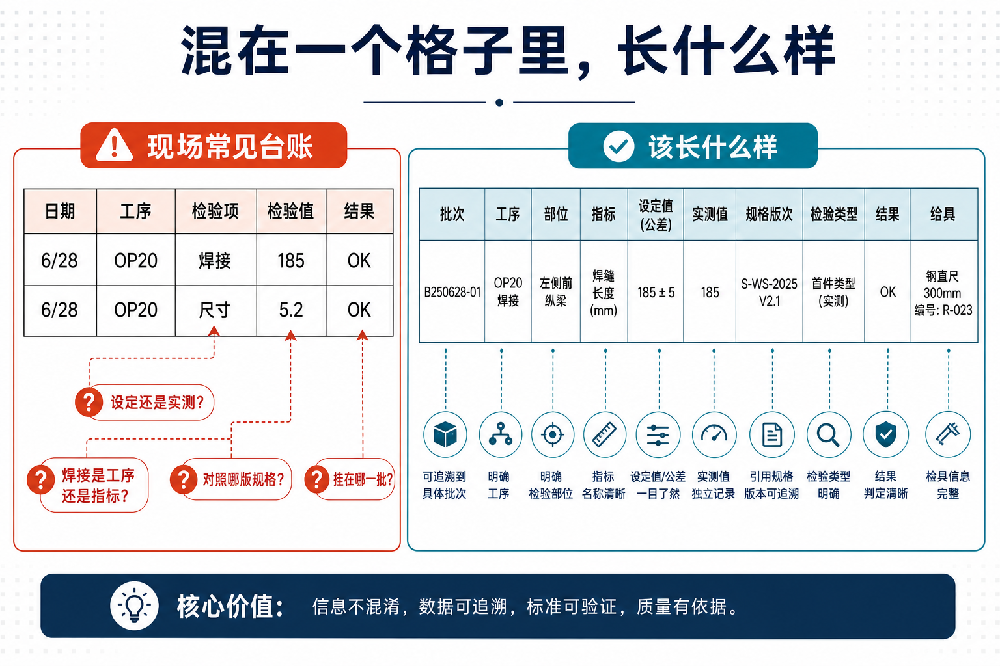
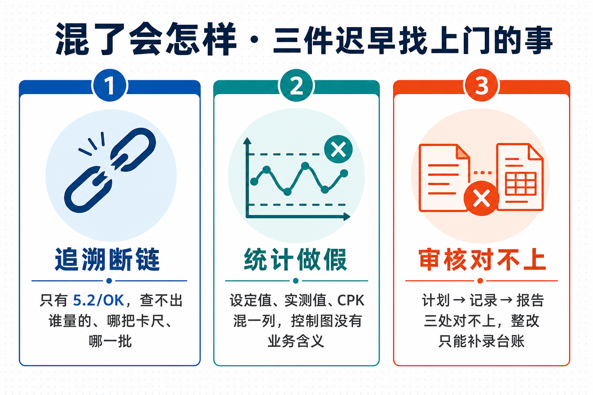
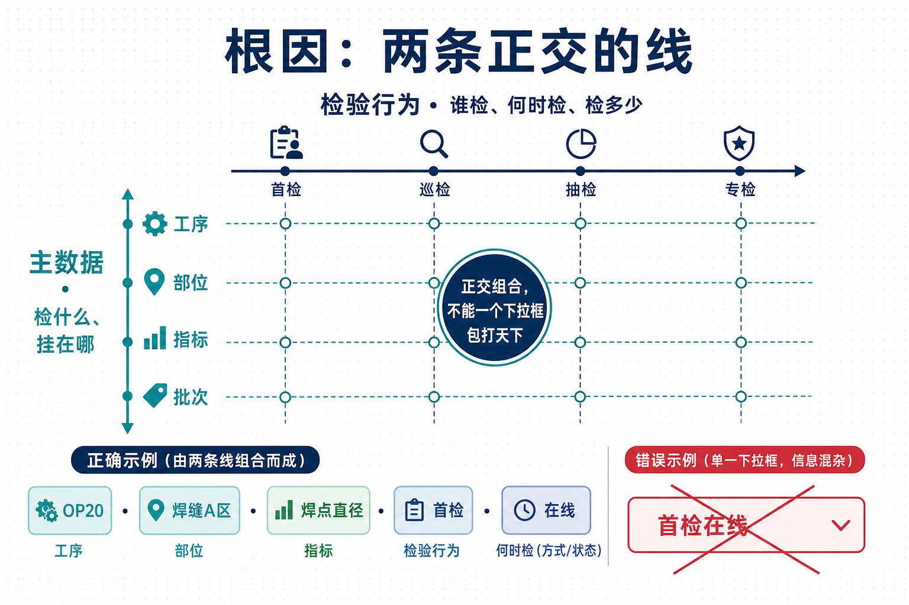
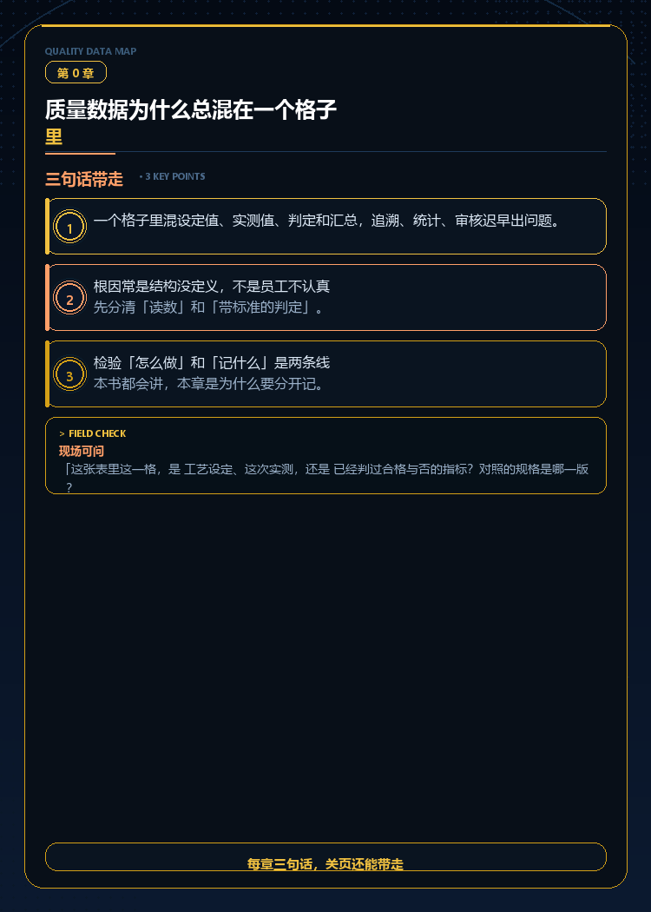

# 质量数据为什么总混在一个格子里

> **关于本章** · 第 0 章 / 共 ~105 章 · 开篇 · 玄兴梦影《质量数据地图》

> **每章三句话，关页还能带走。**

## 先读这一段

你去体检，报告上不会只写一行「5.6」——医生得知道是血糖还是血压、空腹还是餐后、对照什么范围。工厂里也一样：OP20 焊接电流 185A 和焊点直径 5.2mm 是两回事，塞进同一个「检验值」列，后面谁都说不清。

---

## 工厂对话

品质周会上，工艺员说：「这个参数超了，要不要停线？」  
品质工程师回：「你说的是设定值还是实测值？按哪个指标判的？」  
班长打圆场：「反正 Excel 里就一列数，先签字吧。」——三个月后客户要追溯，三个人对着同一张表，谁也还原不出当时到底检了什么。

---

## 一、混在一个格子里，长什么样

| 日期 | 工序 | 检验项 | 检验值 | 结果 |
|------|------|--------|--------|------|
| 6/28 | OP20 | 焊接 | 185 | OK |
| 6/28 | OP20 | 尺寸 | 5.2 | OK |

看起来能用的表格，隐患已经埋好了：

- 「185」是电流 **设定值** 还是 **实测值**？单位呢？
- 「焊接」是 **工序名**、**部位** 还是 **指标名**？
- 「OK」是按什么 **规格** 判的？有没有原始读数留底？
- 换班、换规格、换操作者——**这一行挂在哪一批** 上？

---

## 二、混了会怎样

### 追溯断链

客户问：「6 月 28 日那批，焊缝 A 区直径谁量的、用的哪把卡尺？」若系统里只有「5.2 / OK」，没有 **部位、检具、操作者**，追溯靠猜。

### 统计做假

要上 SPC，得先知道：**同一个指标、同一套规格、同一类子组** 才能画控制图。把设定值、实测值、CPK、合格否全写进一列，曲线 **没有业务含义**。

### 审核对不上

一格混装，计划对记录、记录对报告，**三处对不上**。

---

## 三、根因往往不在「谁没认真填」

- 工艺卡片 **设定值** 和设备 **实测值** 是两层事  
- **指标** 和 **复合指标**（CPK、直通率）不能和单次读数混记  
- **谁检、何时检** 和 **检什么、挂在哪** 是两条正交的线  

---

## 四、本书能帮你什么

> **开会能对齐名词，问问题不闹笑话，上系统前知道表该怎么长。**

下一章：**全书地图**——五概念、三层架构。

---

## 【给做系统的人】

业务台账若只有 `value` + `result` 两列，实施阶段必补维度：**指标 ID、参数类型（设定/实测）、规格版本、批次/序列号、检验类型**。

---

## 本章词条

| 术语 | 人话 |
|------|------|
| **质量数据** | 检验、判定、追溯相关的结构化记录 |
| **设定值** | 工艺卡片上的目标参数 |
| **实测值** | 本次测量或设备读出的数 |
| **指标** | 带规格、能判合格与否的质量项 |
| **追溯** | 由批/件查清检验链 |
| **主数据** | 工序、指标、部位等标准名称表 |

---

## 三句话带走

1. **一个格子里混设定值、实测值、判定和汇总，追溯、统计、审核迟早出问题。**  
2. **根因常是结构没定义——先分清「读数」和「带标准的判定」。**  
3. **检验「怎么做」和「记什么」是两条线。**

**现场可问的一句：**

> 「这一格，是 **工艺设定**、**这次实测**，还是 **已判过合格与否的指标**？对照哪一版规格？」

---

**上一篇：** [序](序-为什么写质量数据地图.md)

---

*工业制造质量管理科普，不涉及具体企业信息。*
