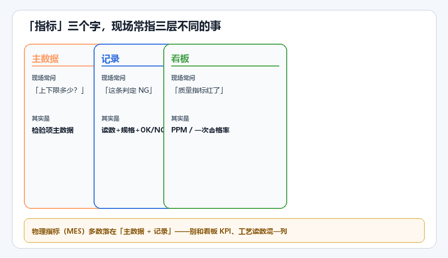

# 物理指标和「指标」是一回事吗？

!!! info "番外"
    不计正篇章号 · 第 0 章留言延伸

## 现场对话

> 「MES 里叫 **物理指标**，品质叫 **指标**、**检验项**——配表的时候到底按谁的字典来？」

MES 小赵：「下拉框就这几个字，我按菜单配。」  
品质小林：「检验项主数据在 QMS，你们别自己造词。」  
班长老周：「反正能填数、能出 OK 就行。」

---

## 先给结论

| 现场说法 | 多半在说什么 | 归哪层 |
|----------|--------------|--------|
| **物理指标**（MES） | 件上要量、要看的特性 | **指标** |
| **指标 / 检验项**（QMS） | 检什么、上下限多少 | 同上 |
| **电流 185A** | 设备这次读数 | **参数** |
| **本件总判 OK** | 多项合成 | **复合指标** |
| **看板质量指标红了** | PPM、一次合格率 | **看板 KPI** |

**一句话：物理指标，十有八九就是「这件上要检的那一项」。**

---

## 为啥系统要写「物理」？

| 叫法 | 意思 | 举例 |
|------|------|------|
| **物理指标** | 量到或目视比对，结果在件上 | 直径 5.0±0.3、外观 B 级 |
| **逻辑指标**（部分系统） | 规则合成 | 尺寸 OK 且外观 OK → 总判 |

- **185A** → 参数（电流读数）  
- **焊点直径 5.1** 对着 **5.0±0.3** 判 OK → **指标**（MES 常叫物理指标）

---

## 「指标」三层误会

1. **主数据** ——「上下限多少？」→ 检验项那一行  
2. **记录** ——「这条判定 NG」→ 读数 + 规格 + OK/NG  
3. **看板** ——「质量指标红了」→ PPM、FPY  

开会多问一句：**「你说的是检哪一项，还是看板上的数？」**

---

## 给 IT / 品质的一张表

| 现场说法 | 主数据类型 | 记录里至少要有 |
|----------|------------|--------------|
| 物理指标 · 尺寸 | 指标 | 读数 + 规格版次 + OK/NG |
| 物理指标 · 外观 | 指标 | 等级/缺陷码 + 判定 |
| 焊接电流实测 | 参数 | 数值 + 单位 |
| 本件总判 OK | 复合指标 | 分项结果，别盖掉读数 |
| 看板一次合格率 | KPI | 分子分母写清楚 |

---

## 三句话带走

1. **物理指标** 在多数 MES 里 ≈ 件上要检的那一项，和 **检验项** 同层。  
2. 它和 **参数读数**、**看板 KPI** 不是一回事。  
3. 叫「物理」也不改铁律：**读数、规格、判定分列。**

---

**正篇：** [第 0 章](../00-质量数据为什么总混在一个格子里.md)

---

*工业制造质量管理科普，不涉及具体企业信息。*
