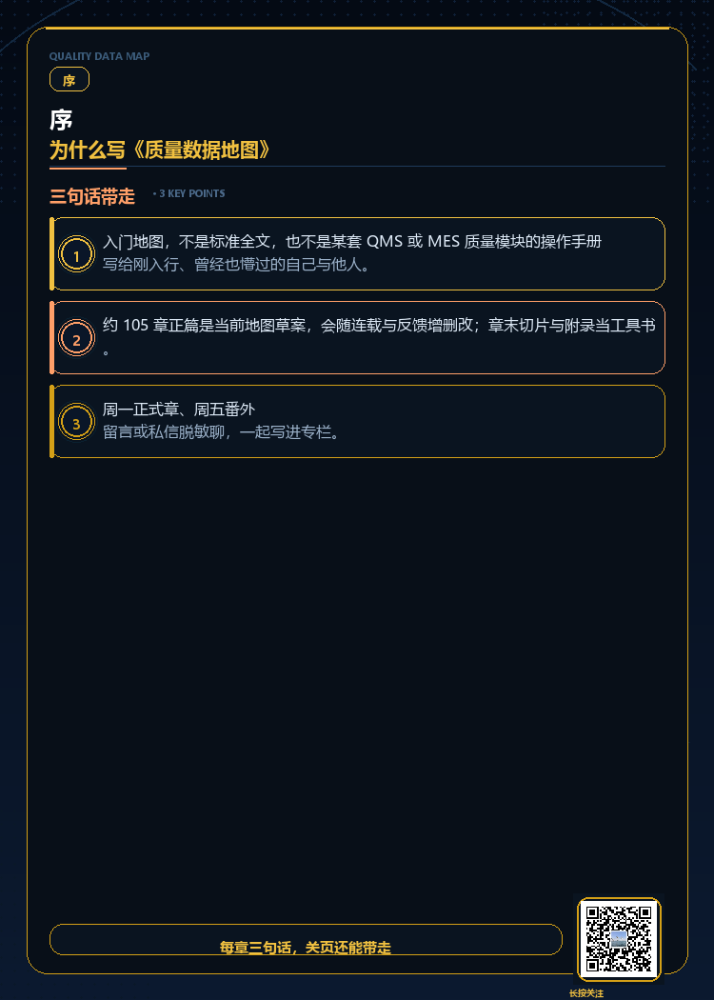

# 序：为什么写《质量数据地图》

> **关于本篇** · 序 · 不计正篇章号 · 玄兴梦影《质量数据地图》连载

## 先读这一段

这不是 IATF/ISO 条文逐条解读，不是独立 **QMS** 的用户手册，也不是 **MES 里「质量管理模块」** 的菜单说明——很多厂只有 MES 上的过站检、首检、不良录入，并没有单独买一套 QMS；本书讲的也不是三天培训班课件换皮。

**《质量数据地图》是一张工业制造质量入门地图**：帮你看清检验、主数据、SPC、预警报警、追溯，以及 **独立 QMS、MES 质量模块、LIMS** 各管哪一段；**能转发给同事，不涉及任何具体企业信息**。各厂产品风险、工艺条件、客户要求不同，**落地以现场质量体系文件为准**。

**连载说明：** 下文目录与分章，是 **目前先定下的构思与写法**——正按周连载成稿。读者留言、私信与现场反馈，可能带来 **章节增补、顺序微调或表述修订**；以专栏已发版本为准，合订时再统一整理。

---

## 一、我见到的反复出现的坑

在工厂和系统项目里待久了，有些对话会 **反复出现**，和行业、规模关系不大：

- 台账里 **设定值、实测值、OK/NG 混在同一列**，三个月后追溯，三个人对着一张表各说各话。
- 首检在 QMS（或 Excel）里通过了，**MES 扫码仍提示「首检未完成」**——两边各记各的，班长只能口头放行。
- 质量会上争 **「CPK 低」还是「看板 KPI 红」**，其实是 **规格、判异、看板** 三种「红」没分清。
- 审核员要 **30 分钟追溯**，五个系统、五份 Excel，**字段名对不上**。

这些不是「某一个人不认真」，常常是 **结构没定义、系统没接住**。本书从这类 **共性坑** 讲起，不写成任何一家厂的内部故事。

---

## 二、这本书里有什么

全书 **约 105 篇正篇 + 2 附录**，按 **两年连载** 发完；主轴是：

**采数 → 分析 → 预警/报警 → 闭环** —— 制造是语境，IT 是载体。

| 块 | 大致章号 | 你会读到什么 |
|----|----------|--------------|
| **开篇 · 地图** | 00–02 | 为什么要分层、五概念、怎么读本书 |
| **检验行为** | 03–05 | 谁检、何时检、在线/离线、两维度组合 |
| **主数据** | 06–12 | 工序、部位、参数、指标、检验计划 |
| **上下文与测量** | 13–25 | 批次、规格、抽样、MSA、子组… |
| **分析** | 26–31 | 控制图、CPK、FPY、看板、过程能力 |
| **预警·报警·处置** | 42–46 | 连载时在分析篇之后读 |
| **闭环与体系** | 32–41 | 追溯、8D、审核、IATF… |
| **制造 · IT · 案例** | 47–85 | QMS、MES、串讲、行业案例 |
| **系统缺口与未来** | 86–102 | 系统为什么接不住质量、选型、收官 |
| **工具附录** | A / B | 字段清单、术语索引（收官后发全文） |

---

## 三、读完后你能带走什么

1. **开会能对齐** —— 说清楚「检的是设定还是实测」「按哪版规格判」。
2. **能画一张检验记录** —— 批次、工序、指标、读数、判定 **该分列**。
3. **会上系统前能问对问题** —— 字段从哪来、首检谁放行、SPC 用什么数。
4. **能认出系统缺口** —— 主数据、流程、集成、产品还是组织 **哪一类没接住**。

---

## 四、我为什么要写

写给 **曾经懵过的自己**，也写给 **刚转品质、刚碰 MES/QMS** 的同事。做过 MES 质量管理模块和周围一圈系统，反复撞上的问题是：**这条数据到底表示什么、该谁记、该谁用**。

---

## 五、和常见质量文有什么不同

| 常见形式 | 本书 |
|----------|------|
| 标准逐条解读 | 工厂对话 + 数据结构 |
| 培训班课件 | ~105 章周更，可跳读、可合订 |
| QMS 操作手册 | 检验与字段结构，不绑品牌 |
| 纯 IT 架构文 | 制造语境优先 |

---

## 六、周一正文、周五番外

- **正式章（周一）** = 教材正篇，按章号连载  
- **番外（周五）** = 留言高频问、脱敏个案，标题带【番外】

---

## 三句话带走

1. **入门地图，不是标准全文，也不是某套 QMS/MES 操作手册。**  
2. **约 105 章正篇是当前地图草案，章末切片与附录当工具书。**  
3. **周一正式章、周五番外——欢迎脱敏留言共创。**

---

**下篇：** [第 0 章 · 质量数据为什么总混在一个格子里](00-质量数据为什么总混在一个格子里.md)

---

*工业制造质量管理科普，不涉及具体企业信息。*
